# Phase 006 — Migration Batch Planning

## Status
PASS

## Objective
Establish a dependency-backed, risk-ranked batch plan and phase definitions for migrating the remaining active React views to Vue 3 (`<script setup lang="ts">` + Pinia + Vue Router), define unambiguous React retirement criteria, enforce the English Track boundary, and establish verification gates without altering application runtime code.

## Verified Current State
- **Phase 001 — Governance & Platform Baseline**: PASS (ADRs 1–3, TS 5.9.3, lockfile canonical).
- **Phase 002 — Vue Shell & Foundations**: PASS (AppShell, Sidebar, TopBar, 22 canonical routes, CommandPalette).
- **Phase 003 — Command Center Vertical Slice**: PASS (`/`, `CommandCenterPage.vue`, `useLearningStore`, React `DashboardView` retired).
- **Phase 004 — Today View Vertical Slice**: PASS (`/today`, `TodayViewPage.vue`, task actions, `Modal.vue`, React `TodayView` retired).
- **Phase 005 — Review Page Vertical Slice**: PASS (`/review`, `ReviewPage.vue`, SM-2 engine integration, React `ReviewView` retired).
- **Verification Gates**:
  - `vue-tsc --noEmit`: PASS (0 errors)
  - `tsc --noEmit` (`lint_applet`): PASS (0 errors)
  - `vitest run`: PASS (9 test files, 87/87 tests passing)
  - `vite build`: PASS (production client bundle compiled)
- **Active React Views Remaining**: 14 views in `src/components/views/`.

## Remaining React Inventory

| React View File | Current Route (`App.tsx`) | Target Vue Route (`router/index.ts`) | Primary Dependencies | State / Store Dependencies | Domain Types | Existing Tests | Complexity |
|---|---|---|---|---|---|---|---|
| `SettingsView.tsx` | `settings` | `/settings` | lucide-react | `currentDay`, `setCurrentDay`, `exportDataAsJson`, `importDataFromJson`, `resetToDemo` | Full state schema | `stateValidation.test.ts` | **S** |
| `RoadmapView.tsx` | `roadmap` | `/learning/roadmap` | lucide-react | `currentDay`, `setCurrentDay`, `roadmapDays` | `RoadmapDay`, `Phase` | None (view level) | **M** |
| `JavaView.tsx` | `java` | `/learning/java` | lucide-react, `CodeBlock` | Local curriculum topics (CompletableFuture, JMM, Virtual Threads, Locks, GC) | 6-step loop | `shell.test.ts` (route) | **S** |
| `SpringView.tsx` | `spring` | `/learning/spring` | lucide-react, `CodeBlock` | Local curriculum topics (@Transactional proxy, JPA N+1, Testcontainers) | 6-step loop | None (view level) | **S** |
| `MicroservicesView.tsx` | `microservices` | `/learning/microservices` | lucide-react, `CodeBlock` | Patterns (Outbox & CDC, Kafka, Saga, Redlock), chaos runner | Distributed pattern models | None (view level) | **M** |
| `ClaudeCodeView.tsx` | `claudecode` | `/build/claudecode` | lucide-react, `CodeBlock` | Prompt templates, sub-agent schemas, MCP configurations | `ClaudeCodeExercise` | None (view level) | **S** |
| `AnalyticsView.tsx` | `analytics` | `/review/progress` | lucide-react | `currentDay`, `streak`, `studyTimeMinutes`, `tasks`, `reviewCards`, `dsaProblems`, `projectFeatures`, `getCompetencies`, `getWeakestDimension` | `CompetencyReadiness` | `competency.test.ts` | **M** |
| `DsaView.tsx` | `dsa` | `/learning/dsa` | lucide-react, `canvas-confetti`, `CodeBlock` | `dsaProblems`, `recordDsaAttempt`, `toggleDsaMastered` | `DSAProblem`, `DSAPattern` | `competency.test.ts` | **M** |
| `KnowledgeView.tsx` | `knowledge` | `/review/knowledge` | lucide-react | `knowledgeTopics`, `updateKnowledgeDimensions` | `KnowledgeTopic`, `MasteryDimensions`, `KnowledgeStatus` | `competency.test.ts` | **L** |
| `ProjectView.tsx` | `project` | `/build/projects` | lucide-react, `canvas-confetti` | `projectFeatures`, `toggleProjectStage` | `ProjectFeature`, `ProjectStage` | `competency.test.ts` | **M** |
| `SystemDesignView.tsx` | `systemdesign` | `/learning/system-design` | lucide-react, `CodeBlock` | `systemDesignProblems`, 45-min drill timer | `SystemDesignProblem` | None (view level) | **M** |
| `IncidentLabView.tsx` | `incident` | `/build/break-debug` | lucide-react, `canvas-confetti`, `CodeBlock` | `incidents`, `investigateIncident`, `resolveIncident` | `IncidentScenario`, `IncidentHypothesis` | `stateValidation.test.ts` | **L** |
| `InterviewView.tsx` | `interview` | `/interview` | lucide-react, `canvas-confetti` | `interviewQuestions`, `createReviewCardFromMistake` | `InterviewQuestion` | `sm2.test.ts` | **M** |
| `EnglishView.tsx` | `english` | (Governed by E01–E06) | lucide-react | `englishSessions`, `updateEnglishPractice` | `EnglishSession` | None | **XL** (Track) |

## Dependency Matrix

```text
View / Feature         | Store Data / Actions              | Engine Dependencies         | UI Primitives Required
-----------------------+-----------------------------------+-----------------------------+--------------------------------------
SettingsView           | exportData, importData, resetDemo | validateBackupJson          | PageHeader, Input, Alert
RoadmapView            | roadmapDays, currentDay           | (Filtering on domain data)  | PageHeader, Input, EmptyState
JavaView               | Local seed curriculum             | (Self-contained 6-step)     | PageHeader, CodeBlock.vue, Badge
SpringView             | Local seed curriculum             | (Self-contained 6-step)     | PageHeader, CodeBlock.vue, Badge
MicroservicesView      | Local seed patterns + chaos state | (Self-contained simulation) | PageHeader, CodeBlock.vue, Alert
ClaudeCodeView         | Local templates                   | (Self-contained templates)  | PageHeader, CodeBlock.vue, Badge
AnalyticsView          | All store collections (read-only) | calculateCompetencies       | PageHeader, StatCard, ProgressBar
DsaView                | dsaProblems, attempts, mastered   | (Competency metrics)        | PageHeader, StatCard, CodeBlock.vue
KnowledgeView          | knowledgeTopics, dimensions       | evaluateTopicDimensions     | PageHeader, EmptyState, Badge
ProjectView            | projectFeatures, stages           | (Competency metrics)        | PageHeader, ProgressBar, Badge
SystemDesignView       | systemDesignProblems              | (45-min countdown timer)    | PageHeader, CodeBlock.vue, Badge
IncidentLabView        | incidents, investigate, resolve   | validateIncidentHypothesis  | PageHeader, CodeBlock.vue, Tabs
InterviewView          | interviewQuestions, mistakes      | calculateSm2Review (sm2.ts) | PageHeader, Alert, Badge
EnglishView            | englishSessions, drills           | sm2.ts, rubric evaluation   | PageHeader, Audio/Phonetics badges
```

## Mermaid Dependency Graph

```mermaid
flowchart TD
    %% Core Foundations
    SHELL[Vue AppShell & Design Tokens]
    STORE[Pinia Learning Store]
    STORAGE[(localStorage SENIOR_JAVA_180_STATE_V1)]
    ENG_SM2[src/engines/sm2.ts]
    ENG_COMP[src/engines/competency.ts]
    ENG_VAL[src/engines/stateValidation.ts]
    SEED[src/data/seedData.ts]

    %% Completed Slices
    CMD[Phase 003: Command Center /]
    TODAY[Phase 004: Today View /today]
    REV[Phase 005: Review Page /review]

    %% Shared Vue UI Primitives
    UI_BASE[PageHeader, StatCard, ProgressBar, Modal, EmptyState]
    UI_CODE[Prerequisite: CodeBlock.vue]

    %% Remaining Views
    V_SETT[Phase 007: Settings & Backup]
    V_ROAD[Phase 008: 180-Day Roadmap Explorer]
    V_JAVA[Phase 009: Java 25 & Spring Curriculum]
    V_MICRO[Phase 010: Microservices & Claude Code Labs]
    V_ANALYTICS[Phase 011: Analytics & Readiness]
    V_DSA[Phase 012: DSA Pattern Mastery]
    V_KNOW[Phase 013: 6D Knowledge Matrix]
    V_PROJ[Phase 014: Project Engineering Matrix]
    V_SD[Phase 015: System Design Studio]
    V_INC[Phase 016: Incident Chaos War-Room]
    V_INT[Phase 017: Senior Interview Screen]
    V_AWS[Phase 018: AWS AIF-C01 Track]
    V_RETIRE[Phase 019: Complete React Retirement]

    %% Linkages
    SHELL --> UI_BASE
    UI_BASE --> UI_CODE
    STORAGE <--> STORE
    SEED --> STORE

    STORE --> CMD
    STORE --> TODAY
    STORE --> REV
    ENG_SM2 --> REV

    %% Future Phase Dependencies
    STORE --> V_SETT
    ENG_VAL --> V_SETT

    STORE --> V_ROAD
    UI_BASE --> V_ROAD

    UI_CODE --> V_JAVA
    UI_CODE --> V_MICRO

    STORE --> V_ANALYTICS
    ENG_COMP --> V_ANALYTICS

    STORE --> V_DSA
    UI_CODE --> V_DSA

    STORE --> V_KNOW
    ENG_COMP --> V_KNOW

    STORE --> V_PROJ
    ENG_COMP --> V_PROJ

    STORE --> V_SD
    UI_CODE --> V_SD

    STORE --> V_INC
    ENG_VAL --> V_INC
    UI_CODE --> V_INC

    STORE --> V_INT
    ENG_SM2 --> V_INT

    STORE --> V_AWS
    ENG_SM2 --> V_AWS

    V_SETT & V_ROAD & V_JAVA & V_MICRO & V_ANALYTICS & V_DSA & V_KNOW & V_PROJ & V_SD & V_INC & V_INT & V_AWS --> V_RETIRE
```



## Complexity Classification

- **Simple (S)**:
  - `SettingsView`: Pure utility form with JSON export/import via existing engine validation (`validateBackupJson`). Minimal styling, high leverage for safety.
  - `JavaView` & `SpringView`: Content-driven curriculum tabs implementing the senior engineering loop with code blueprints and pitfall analysis.
  - `ClaudeCodeView`: Static prompt templates, MCP configurations, and copy actions.
- **Medium (M)**:
  - `RoadmapView`: Multi-phase filtering, search query filtering, day-detail drawer, direct sync with `currentDay` and navigation to `/today`.
  - `AnalyticsView`: Multi-dimension metric aggregation, competency readiness curves, countdown estimation, zero new mutations.
  - `DsaView`: Pattern categorization, problem search, live stopwatch timer, mastery toggles, LeetCode link-outs.
  - `ProjectView`: 10-stage microservice feature matrix, multi-service filtering, progress aggregation across 8 microservices.
  - `SystemDesignView`: 45-minute countdown drill timer, multi-tab technical blueprint layout, capacity estimation math cards.
  - `InterviewView`: Category-filtered flashcard screen, mental retrieval simulation, mistake-to-review-card conversion via SM-2.
- **Complex (L)**:
  - `KnowledgeView`: 6-dimensional mastery sliders (`theory`, `handsOn`, `recall`, `explanation`, `debugging`, `interview`), real-time status calculation (`PRACTICING`, `UNDERSTOOD`, `MASTERED`), expandable red-flag details.
  - `IncidentLabView`: Simulated production war-room, multi-tab telemetry analysis (thread dumps, GC spikes, Kafka lag), hypothesis submission with automated validation against `src/engines/stateValidation.ts`.
  - `CertificationsAifView` (AWS AIF-C01): Comprehensive AWS certification study engine, domain weighting, scenario drills, readiness scoring.
- **Cross-domain / Architectural (XL)**:
  - `EnglishTrack` (Phases E01–E06): Integrated English competencies across TOEIC, Workplace Communication, and Technical English (ADR-006). Governed as a dedicated workstream.

## Migration Batches

### Batch 1 — Core Navigation, System Governance & Data Portability
- **Target Views**: `SettingsView` (Phase 007), `RoadmapView` (Phase 008)
- **Prerequisites**: Phase 005 PASS, `useLearningStore`
- **Shared Components Required**: `PageHeader.vue`, `Input`, `Alert`, `EmptyState.vue`
- **Store Changes Required**: Expose `exportDataAsJson()`, `importDataFromJson(json)`, `resetToDemo()`
- **Engine Dependencies**: `validateBackupJson` (`src/engines/stateValidation.ts`)
- **Persistence Impact**: Direct import/export/reset of `localStorage['SENIOR_JAVA_180_STATE_V1']`
- **Test Requirements**: Unit tests for settings backup/restore and roadmap filtering/selection
- **Expected Migration Risk**: Low. Ensures data portability before proceeding to deeper views
- **Exit Criteria**: Settings and Roadmap rendered in Vue, React `SettingsView.tsx` and `RoadmapView.tsx` retired

### Batch 2 — Curriculum Tracks & Code Architecture Labs
- **Target Views**: Shared `CodeBlock.vue` + `JavaView` & `SpringView` (Phase 009), `MicroservicesView` & `ClaudeCodeView` (Phase 010)
- **Prerequisites**: Batch 1 PASS
- **Shared Components Required**: `CodeBlock.vue` (with syntax highlight and copy button), `Badge`
- **Store Changes Required**: None (curriculum data is self-contained seed content)
- **Engine Dependencies**: None
- **Persistence Impact**: None
- **Test Requirements**: Tests verifying tab navigation, code rendering, and chaos scenario transitions
- **Expected Migration Risk**: Low. High visual impact with minimal state complexity
- **Exit Criteria**: Tracks rendered in Vue, React `JavaView`, `SpringView`, `MicroservicesView`, and `ClaudeCodeView` retired

### Batch 3 — Mastery Tracking, Analytics & Practice
- **Target Views**: `AnalyticsView` (Phase 011), `DsaView` (Phase 012), `KnowledgeView` (Phase 013)
- **Prerequisites**: Batch 2 PASS
- **Shared Components Required**: `StatCard.vue`, `ProgressBar.vue`, 6-dimension mastery input
- **Store Changes Required**: `recordDsaAttempt`, `toggleDsaMastered`, `updateKnowledgeDimensions`
- **Engine Dependencies**: `calculateCompetencies`, `evaluateTopicDimensions`, `findWeakestDimension`
- **Persistence Impact**: Updates `dsaProblems` and `knowledgeTopics` in localStorage
- **Test Requirements**: Tests for competency calculation rendering, DSA stopwatch, and knowledge dimension updates
- **Expected Migration Risk**: Medium. Requires precise state synchronization with `competency.ts`
- **Exit Criteria**: All 3 views rendered in Vue, React `AnalyticsView`, `DsaView`, and `KnowledgeView` retired

### Batch 4 — Deep Interactive Labs & System Architecture
- **Target Views**: `ProjectView` (Phase 014), `SystemDesignView` (Phase 015), `IncidentLabView` (Phase 016)
- **Prerequisites**: Batch 3 PASS
- **Shared Components Required**: `ProgressBar.vue`, `CodeBlock.vue`, `Modal.vue`, tab bar
- **Store Changes Required**: `toggleProjectStage`, `systemDesignProblems` state, `investigateIncident`, `resolveIncident`
- **Engine Dependencies**: `validateIncidentHypothesis` (`src/engines/stateValidation.ts`)
- **Persistence Impact**: Updates `projectFeatures` and `incidents` in localStorage
- **Test Requirements**: Tests for 10-stage checklist, 45-min timer, and hypothesis validation
- **Expected Migration Risk**: Medium-High. Incident lab contains rich simulated telemetry
- **Exit Criteria**: All 3 views rendered in Vue, React `ProjectView`, `SystemDesignView`, and `IncidentLabView` retired

### Batch 5 — Interview Simulation & AWS Certification Track
- **Target Views**: `InterviewView` (Phase 017), `CertificationsAifView` (Phase 018)
- **Prerequisites**: Batch 4 PASS
- **Shared Components Required**: Flip card, model answer card, rating buttons
- **Store Changes Required**: `interviewQuestions` state in store (seed data exists)
- **Engine Dependencies**: `src/engines/sm2.ts` (`createReviewCardFromMistake`)
- **Persistence Impact**: Appends to `reviewCards` in localStorage
- **Test Requirements**: Tests for category filtering, answer reveal, and card generation from mistakes
- **Expected Migration Risk**: Medium. Well-established pattern from Phase 005 Review slice
- **Exit Criteria**: Both views rendered in Vue, React `InterviewView` retired

### Batch 6 — Complete React Retirement & Final Cutover
- **Target Views**: `src/App.tsx`, `src/components/`, `src/context/`, `package.json` (Phase 019)
- **Prerequisites**: Batches 1–5 PASS (zero active React routes remaining)
- **Shared Components Required**: None (all components in `src/vue/components/`)
- **Store Changes Required**: None
- **Engine Dependencies**: None
- **Persistence Impact**: None
- **Test Requirements**: Full test suite passes without `@testing-library/react` or React dependencies
- **Expected Migration Risk**: High if done prematurely; Low when executed as the final cleanup phase
- **Exit Criteria**: React packages removed, index.html mounts Vue directly, `npm run build` succeeds cleanly

## Future Phase Definitions

```text
Phase 007 — Settings & Backup Slice (SettingsPage.vue, export/import JSON, resetToDemo)
Phase 008 — 180-Day Roadmap Explorer Slice (RoadmapPage.vue, phase filters, day detail panel)
Phase 009 — CodeBlock Prerequisite & Core Curriculum Tracks (Java 25 & Spring Boot Pages)
Phase 010 — Distributed Systems & Agent Labs (Microservices & Claude Code Pages)
Phase 011 — Senior Analytics & Readiness Slice (AnalyticsPage.vue, competency metrics)
Phase 012 — DSA Pattern Practice Slice (DsaPage.vue, stopwatch, pattern filters)
Phase 013 — 6D Knowledge Matrix Slice (KnowledgePage.vue, 6-dimension mastery sliders)
Phase 014 — Project Engineering Labs Slice (ProjectsPage.vue, 10-stage microservices checklist)
Phase 015 — System Design Studio Slice (SystemDesignPage.vue, 45-min drill timer)
Phase 016 — Production Incident & Chaos Lab Slice (IncidentLabPage.vue, telemetry triage)
Phase 017 — Senior Technical Interview Drills Slice (InterviewPage.vue, mistake-to-review)
Phase 018 — AWS AIF-C01 Certification Track Slice (AwsAifCertificationPage.vue)
Phase 019 — Complete React Retirement & Pure Vue Cutover (Remove React dependencies & legacy code)
```

## English Track Boundary
- Governed under **ADR-006** as an independent, interconnected workstream (`E01`–`E06`):
  - `E01`: English Foundation & Schema Extension
  - `E02`: TOEIC Core Practice (Reading/Listening)
  - `E03`: Workplace & Technical Communication
  - `E04`: Technical English & Deep Java/AWS Integration
  - `E05`: Interview English Simulation & Defense Rubric
  - `E06`: English Command Center Dashboard
- **Integration Points**:
  - Reuses pure SM-2 engine (`src/engines/sm2.ts`) and `ReviewCard` structure for vocabulary and idioms.
  - Integrates into `RoadmapDay.englishFocus` and the `EXPLAIN` / `DEFEND` / `INTERVIEW` stages.
  - Anchors in Command Center via the Recommended Action engine when English drills are due.
- **Boundary Rule**: English Track implementation must NOT be interleaved ad-hoc with core view migration phases. Core platform technical slices must maintain architectural stability.

## React Retirement Criteria
React removal will only be authorized when ALL of the following criteria are met:
1. **Zero Active React Routes**: All 16 primary navigation views render native Vue 3 components registered in `src/vue/router/index.ts`.
2. **Zero React View Dependencies**: All files in `src/components/views/` have been safely removed.
3. **Zero Shared React UI Dependencies**: All shared primitives (`src/components/ui/*`) are replaced by Vue equivalents in `src/vue/components/*`.
4. **Context Retirement**: `src/context/LearningContext.tsx` is completely replaced by Pinia stores.
5. **Entrypoint Cutover**: `index.html` loads `src/vue/main.ts` directly; `src/main.tsx` and `src/App.tsx` are deleted.
6. **Package Deprecation**: `react`, `react-dom`, `@types/react`, `@types/react-dom`, and `@testing-library/react` are uninstalled from `package.json`.
7. **Verification Gate**:
   - `npx vue-tsc --noEmit` passes with 0 errors
   - `npx tsc --noEmit` passes with 0 errors
   - `npx vitest run` passes 100% of test suites with zero React test references
   - `npx vite build` produces a clean production distribution

## Test Strategy
For every subsequent phase (Phases 007 through 019):
1. **Targeted Unit Tests**: Every newly migrated Vue page must have a dedicated test file in `src/vue/__tests__/` covering:
   - Success rendering of all primary domain elements
   - Honest empty state when store has no records
   - Interactive user actions (button clicks, form submits, timer toggles)
   - Store action dispatch and persistence checks
2. **Regression Test Suite**:
   - Run `npx vitest run` to ensure all existing Vue and pure engine tests pass with zero regressions.
3. **Type Safety & Build Gates**:
   - `npx vue-tsc --noEmit` (Vue SFC validation)
   - `npx tsc --noEmit` (Global project validation)
   - `npx vite build` (Vite production asset compilation)

## Risks / Blockers
1. **`CodeBlock.vue` Prerequisite**: Multiple views (`Java`, `Spring`, `Microservices`, `IncidentLab`, `SystemDesign`, `ClaudeCode`) require formatted code display with copy-to-clipboard functionality. Creating `CodeBlock.vue` in Phase 009 resolves this dependency upstream.
2. **Dynamic Route Chunk Imports in Vitest**: As discovered in Phase 005, memory-router test environments can experience timing issues with lazy-loaded components. Tests must either pre-resolve routes or import page components directly in test setup.
3. **Headless Canvas in Testing**: `canvas-confetti` requires graceful guard checks (`canvas.getContext && canvas.getContext('2d')`) to avoid jsdom unhandled exceptions.

## Exit Criteria
- [x] All remaining React views inventoried with routes, dependencies, models, and complexity.
- [x] Dependency matrix and Mermaid graph constructed based on actual repository code.
- [x] Sequential migration batches defined with strict prerequisites and exit criteria.
- [x] Concrete future phases (Phase 007 through Phase 019) defined.
- [x] English Track boundary explicitly documented.
- [x] React retirement criteria established.
- [x] Zero application source code modified during Phase 006.

## Evidence
- `git status` check: verified non-git container environment (`fatal: not a git repository`).
- React inventory verified via `src/components/views/` (14 active files inspected).
- Route map verified against `src/App.tsx` and `src/vue/router/index.ts`.
- Type-check verification: `vue-tsc --noEmit` (0 errors), `tsc --noEmit` (0 errors).
- Vitest suite verification: 9 test files, 87/87 tests PASS.
- Production build verification: `vite build` completed successfully.


